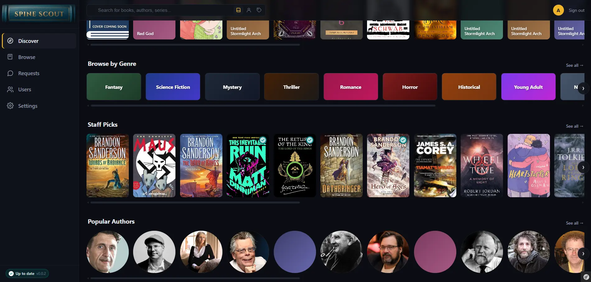
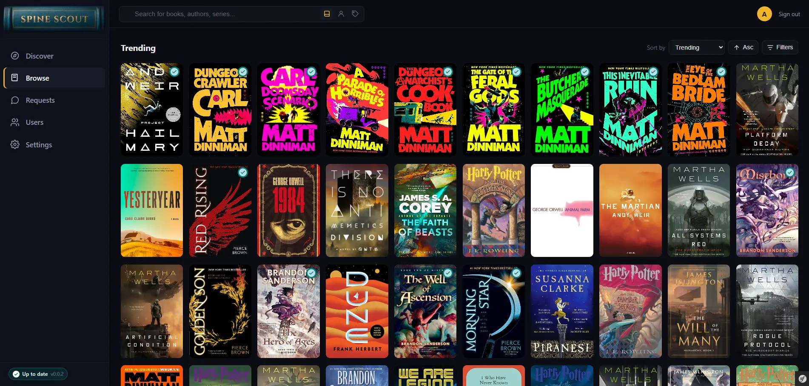
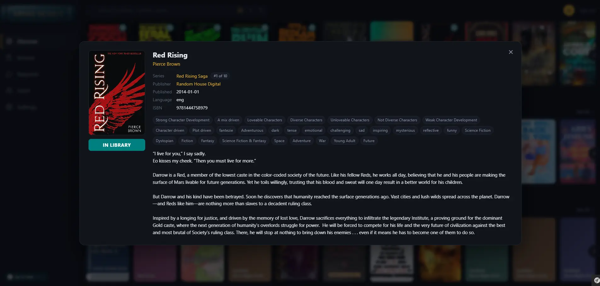

# Spine Scout


> [!WARNING]
> **Early access - active development.** Spine Scout is a brand-new project under active maintenance. Expect breaking changes, rough edges, and incomplete features. Pin to a specific image tag if you deploy it, and back up your database before upgrading.

Spine Scout is a self-hosted **discovery and request hub for books** - think *Seerr, but for books*. It is the glue between where you find books, how you get them, and where they end up.

Spine Scout itself does **not** host your library. It orchestrates the surrounding tools: it offers the search UI, the request/approval workflow, duplicate checks against your library.

It is designed to plug into:

- **[Grimmory](https://github.com/grimmory-tools/grimmory)** / Booklore - the library / reader that owns the files
- **[Hardcover](https://hardcover.app/)**, **[Open Library](https://openlibrary.org/)** - metadata providers

## 📊 Feature Status

Spine Scout is early-access and being built in phases. The table below lists only what is **not yet done** - anything not listed here is considered implemented and working.

| Area | Status          | Notes                                                                              |
|--|-----------------|------------------------------------------------------------------------------------|
| Adding / managing additional users | Partial         | Admin user is created via first-run wizard; multi-user management UI not yet built |
| Production Docker image | Partial         | Dev compose works; published prod image not yet shipped                            |
| Requesting books | Partial         | No automatic approval process yet                                                  |
| Downloading / fulfillment | Partial         | Basics Implemented, initial testing positive                                       |
| External list importers (Goodreads, RSS, CSV) | Not Implemented | Planned                                                                            |

## 📸 Screenshots

<p align="center">
  
  <br><em>Home screen with curated sections</em>
</p>

<p align="center">
  
  <br><em>Browse books</em>
</p>

<p align="center">
  
  <br><em>Book detail popup</em>
</p>

<p align="center">
  
  <br><em>Author detail popup</em>
</p>

## ✨ Features

- **Unified search** - query metadata providers (Hardcover, Open Library) for rich book discovery
- **Request workflow** - family and trusted users browse and request books; admins approve and route them to a downloader
- **Library awareness** - syncs against your Grimmory / Booklore library so users see what's already owned and avoid duplicate requests
- **Multi-user** - built-in accounts with admin/user roles; per-user request history
- **Pluggable integrations** - each external system lives behind a clean client boundary so you can mix and match (or extend) the tools you already self-host
- **Background sync** - Symfony Messenger + Scheduler keep library state and metadata fresh on a configurable cadence

## 🚀 Quick Start

### Prerequisites

- Docker & Docker Compose

### Installation

1. Clone the repository:
   ```bash
   git clone https://github.com/Krught/Spine-Scout.git
   cd spine-scout
   ```

2. Copy the environment template and edit the values you want to change (at minimum the secrets):
   ```bash
   cp .env.template .env
   ```

3. Start the stack:
   ```bash
   docker compose up -d
   ```

4. Open `http://localhost:9092` and complete the setup wizard to create your admin account and configure your first integration.

### Environment Variables

| Variable | Description | Default |
|--|--|--|
| `APP_ENV` | Symfony environment (`prod` or `dev`) | `prod` |
| `APP_SECRET` | Symfony app secret - **change this** | (placeholder) |
| `SPINESCOUT_HTTP_PORT` | Host port for the web UI | `9092` |
| `SPINESCOUT_COVER_CACHE_DIR` | Host path for the on-disk cover cache | `./book-covers` |
| `POSTGRES_DB` / `POSTGRES_USER` / `POSTGRES_PASSWORD` | Database credentials - **change these** | `app` / `app` / `ChangeMe!` |
| `DATABASE_URL` | Full Postgres DSN (built from the values above) | derived |
| `MESSENGER_TRANSPORT_DSN` | Symfony Messenger transport | `doctrine://default?auto_setup=0` |

## ⚙️ Configuration

Most configuration happens in the **Settings** area of the web UI after first launch. From there you can:

- Connect your **Grimmory / Booklore** library (Komga-compatible REST API)
- Add **metadata provider** credentials (Hardcover API key, etc.)
- Manage users, roles, and per-user request preferences
- Adjust per-integration sync cadence and trigger manual "Sync now" runs

## 🛠️ Tech Stack

- **Symfony 8** (PHP 8.4) - framework, HTTP client, Messenger, Scheduler, Security
- **PostgreSQL 16** + **Doctrine ORM / Migrations**
- **Twig** + **Symfony UX** (Stimulus / Turbo) + **AssetMapper / importmap**
- **Docker Compose** - nginx + php-fpm + worker + database

More detail in [`project_documentation/`](project_documentation/).

## 🧑‍💻 Development

```bash
# Bring up the dev stack
docker compose up -d

# Run migrations
docker compose exec app php bin/console doctrine:migrations:migrate

# Run tests
docker compose exec app vendor/bin/phpunit

# Tail logs
docker compose logs -f app worker
```

## 📄 License

See [LICENSE](LICENSE).

## ⚠️ Disclaimer

Spine Scout is a discovery and orchestration interface that displays results from external metadata providers. **It does not host, store, or distribute any content of its own.** The developers are not responsible for how this tool is used or for what is accessed through it.

Users are solely responsible for:

- Ensuring they have the legal right to access, download, or store any material discovered or requested through Spine Scout
- Complying with copyright laws and intellectual property rights in their jurisdiction
- Understanding and accepting the terms of any external services, sources, or integrations they configure

Use of this tool is entirely at your own risk.
